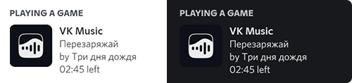

# <div align="center">VK Rich Presence</div>

<div align="center">
  Транслирование текущей песни из VK Музыки в Discord

  <br />
  <br />

  
</div>

---

### Требования:

- Расширение для работы пользовательских скриптов Tampermonkey (или Violentmonkey/Greasemonkey и т.п.)
- Node.js версии `14` и выше

### Установка:

```sh
# Пакетный менеджер pnpm (если нет)
npm i -g pnpm

# Зависимости
pnpm install

# Сборка API и пользовательского скрипта
pnpm -r build
```

### Запуск:

Для работы необходимо запустить API сервер и установить пользовательский скрипт.
API сервер и пользовательский скрипт по умолчанию используют: `127.0.0.1:25361`

#### API:

```
node packages/api/build
```

#### Пользовательский скрипт:

1. Создать новый пользовательский скрипт в Tampermonkey
2. Переписать содержимое по умолчанию на следующее:

```js
// ==UserScript==
// @name        Discord Rich Presence
// @namespace   Violentmonkey Scripts
// @match       *://vk.com/*
// @grant       none
// @version     1.0
// @author      _
// @description Yes
// ==/UserScript==

// Скрипт после этой строки
```

3. Скопировать и добавить в скрипт выше содержимое `packages/extension/build/userscript.js`
